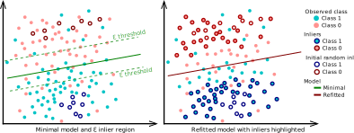

## RANSAC for R

> RANdom SAmple Consensus in R using generalized linear models

This is a prototype package of a RANSAC implementation for R.

Diagram with example of RANSAC with logistic regression.

